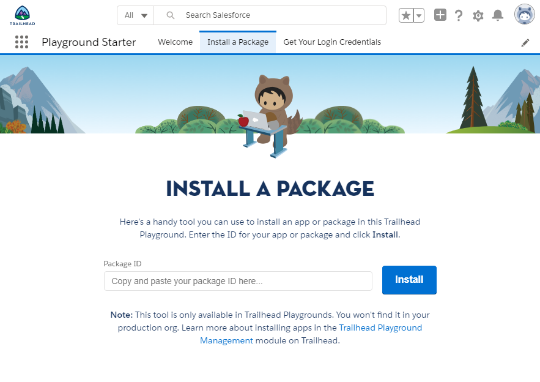

# Excel to Records

Repository under construction.

## Install Unlocked Package

Install the unlocked package with this ID: 04t3X000002c3zPQAQ

In Trailhead Playgrounds, you can do it by copy/pasting the ID in the install page:



## Install with Metadata API by deploying the src folder

To deploy this repository using the classic Metadata API, execute the folowing command line from the cloned workspace:

```
sfdx force:mdapi:deploy --zipfile src/excel-to-records.zip --wait 10 --singlepackage --targetusername /*username or alias for the target environment*/
```

## Useful command lines for development

Retrieve with Metadata API format:

```
sfdx force:mdapi:retrieve --targetusername ExcelToRecordsSO --wait 10 --unpackaged manifest/package.xml --retrievetargetdir src --singlepackage
```

Create a package version:

```
sfdx force:package:version:create --package "Excel to Records" --path excel-to-records --installationkeybypass --wait 10 --targetdevhubusername ExcelToRecords
```